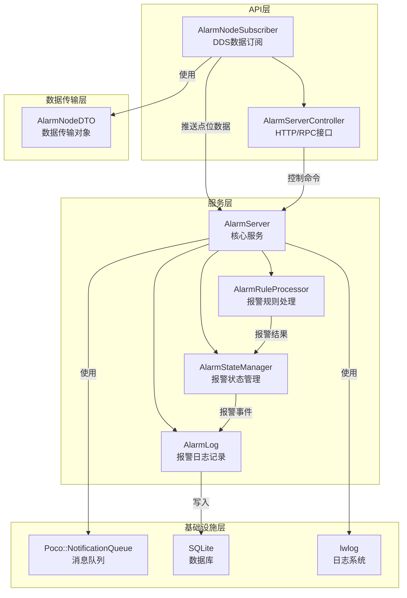

# Alarm-Server 设计与使用手册

## 1. 项目概述

Alarm-Server 是一个基于 DDS (Data Distribution Service) 通信协议的报警服务系统，用于监控和处理来自 NodeServer 的点位数据报警。系统通过多种报警规则对点位数据进行分析，当触发报警条件时，及时发布报警通知并记录报警日志。

### 1.1 主要功能

- **DDS 数据订阅**：通过 DDS 协议接收来自 NodeServer 的点位数据
- **多类型报警规则**：支持阈值报警、定值报警、变化率报警、持续时间报警和偏差报警
- **智能报警处理**：基于优先级的报警规则判断和状态管理
- **报警状态管理**：维护报警状态，支持报警触发和恢复通知
- **报警日志记录**：将报警事件记录到 SQLite 数据库
- **模块化设计**：清晰的分层架构，便于维护和扩展

### 1.2 技术栈

- **编程语言**：C++
- **通信协议**：DDS (基于 lwdistcomm 库)
- **消息队列**：Poco::NotificationQueue
- **数据库**：SQLite (Poco::Data)
- **日志系统**：lwlog
- **构建系统**：CMake

## 2. 系统架构

### 2.1 整体架构

Alarm-Server 采用模块化、分层设计，主要分为以下几个层次：

1. **API 层**：负责与外部系统的通信，包括 DDS 订阅和 HTTP/RPC 接口
2. **服务层**：包含核心的报警处理逻辑，如规则处理、状态管理和日志记录
3. **数据传输层**：定义数据传输对象 (DTO)，确保数据在不同模块间的一致性
4. **基础设施层**：提供消息队列、数据库操作等基础服务

### 2.2 模块关系



## 3. 核心模块详解

### 3.1 AlarmServer

**功能**：作为系统的核心服务，负责初始化配置、启动报警处理线程、接收点位数据并协调各模块工作。

**主要组件**：
- **消息队列**：使用 `Poco::NotificationQueue` 异步处理点位数据
- **报警规则配置**：从数据库加载报警规则配置
- **报警处理线程**：持续处理队列中的点位数据，调用相应的规则处理器进行报警判断

**关键方法**：
- `InitAlarmServerQueue()`：初始化报警服务，加载配置并启动处理线程
- `PushAlarmMsg()`：向消息队列推送点位数据
- `run()`：报警处理线程主函数，协调规则处理和状态管理

### 3.2 AlarmRuleProcessor

**功能**：负责处理不同类型的报警规则，判断点位数据是否触发报警条件。

**规则类型**：
1. **阈值报警**：判断数据是否超过设定的高限或低限
2. **定值报警**：判断数据是否等于设定的特定值
3. **变化率报警**：判断数据在设定时间窗口内的变化率是否超过阈值
4. **持续时间报警**：判断数据持续超过阈值的时间是否达到设定值
5. **偏差报警**：判断数据与参考值的偏差是否超过设定阈值

**设计模式**：使用工厂模式 `AlarmRuleProcessorFactory` 创建不同类型的规则处理器。

### 3.3 AlarmStateManager

**功能**：管理报警状态，处理报警触发和恢复逻辑，发布报警通知。

**主要功能**：
- **状态管理**：维护每个点位的报警状态
- **报警判断**：根据规则处理结果判断是否需要触发报警
- **通知发布**：当报警状态变化时，发布报警通知
- **报警恢复**：处理报警恢复逻辑，发布恢复通知

### 3.4 AlarmLog

**功能**：记录报警事件到 SQLite 数据库，提供报警历史查询。

**主要功能**：
- **日志记录**：将报警触发和恢复事件记录到数据库
- **历史查询**：提供接口查询历史报警记录
- **统计分析**：支持报警统计和分析

### 3.5 AlarmNodeSubscriber

**功能**：通过 DDS 协议订阅 NodeServer 发布的点位数据。

**主要功能**：
- **DDS 连接管理**：建立和维护与 NodeServer 的 DDS 连接
- **数据订阅**：订阅点位数据主题
- **数据解析**：解析接收到的 DDS 消息，转换为内部数据格式
- **数据推送**：将解析后的数据推送给 AlarmServer 进行处理

## 4. 数据结构设计

### 4.1 核心数据结构

#### AlarmRule

```cpp
struct AlarmRule {
    int id;                      // 规则唯一ID（来自数据库）
    std::string name;            // 报警名称，如 "高温报警"
    int method;                  // 1~8（报警类型）
    float threshold;             // 阈值
    float param1;                // 变化率规则：时间窗口（秒）
    float param2;                // 持续时间规则：持续时间（秒）
    float param3;                // 偏差规则：参考值
    bool enabled = true;         // 是否启用
    std::string point_id;        // 点位ID
    std::string point_name;      // 点位名称
    // 用于排序的优先级（越小越先判断）
    static int getPriority(int method);
    bool operator<(const AlarmRule& other) const;
};
```

#### AlarmState

```cpp
struct AlarmState {
    bool active = false;               // 报警是否激活
    long long last_trigger_time = 0;   // 最后触发时间（毫秒）
    long long activation_time = 0;     // 激活时间（用于持续时间规则）
    AlarmState(bool active, long long last_trigger_time);
    AlarmState() = default;
};
```

#### AlarmMessage

```cpp
class AlarmMessage {
public:
    enum class Type { CLEAR = 0, TRIGGER };
    AlarmMessage(
        const std::string& point_name,
        const std::string& alarm_name,
        float value,
        float threshold,
        int method,
        Type type
    );
    // getters...
private:
    std::string point_name_;
    std::string alarm_name_;
    float value_;
    float threshold_;
    int method_;
    Type type_;
};
```

### 4.2 DTO 结构

**AlarmNodeDTO**：用于 DDS 通信的数据传输对象，定义了点位数据的格式。

## 5. 配置与使用

### 5.1 数据库配置

#### 表结构

1. **t_points**：点位信息表
   - id: 点位ID
   - name: 点位名称
   - description: 点位描述

2. **t_alarm_rules**：报警规则表
   - id: 规则ID
   - point_id: 关联的点位ID
   - name: 报警名称
   - method: 报警类型（1-8）
   - threshold: 阈值
   - param1: 参数1（变化率时间窗口）
   - param2: 参数2（持续时间）
   - param3: 参数3（偏差参考值）
   - enable: 是否启用

3. **t_alarm_states**：报警状态表（字典表）
   - id: 状态ID
   - name: 状态名称（如"正常"、"报警"、"恢复"、"确认"）
   - description: 状态描述

### 5.2 报警类型配置

| 报警类型 | 方法值 | 描述 | 参数说明 |
|---------|-------|------|----------|
| 高高限 | 1 | 超过最高阈值 | threshold: 最高阈值 |
| 高限 | 2 | 超过高阈值 | threshold: 高阈值 |
| 低限 | 3 | 低于低阈值 | threshold: 低阈值 |
| 低低限 | 4 | 低于最低阈值 | threshold: 最低阈值 |
| 定值 | 5 | 等于特定值 | threshold: 特定值 |
| 变化率 | 6 | 变化率超过阈值 | threshold: 变化率阈值<br>param1: 时间窗口（秒） |
| 持续时间 | 7 | 持续超过阈值时间 | threshold: 阈值<br>param2: 持续时间（秒） |
| 偏差 | 8 | 与参考值偏差超过阈值 | threshold: 偏差阈值<br>param3: 参考值 |

### 5.3 使用流程

1. **启动服务**：运行 Alarm-Server 服务
2. **配置报警规则**：在数据库中配置点位的报警规则
3. **数据订阅**：Alarm-Server 自动通过 DDS 订阅 NodeServer 的点位数据
4. **报警处理**：系统根据配置的规则处理点位数据，触发报警时发布通知
5. **报警查询**：通过 HTTP/RPC 接口查询报警状态和历史记录

## 6. 编译与安装

### 6.1 依赖项

- **C++11 或更高版本**
- **CMake 3.10 或更高版本**
- **Poco 库**：用于消息队列和数据库操作
- **lwdistcomm 库**：用于 DDS 通信
- **SQLite 数据库**
- **lwlog 库**：用于日志记录

### 6.2 编译步骤

1. **进入项目目录**
   ```bash
   cd /home/yanchaodong/work/acoinfo/edge-framework/src/service/alarm-server
   ```

2. **创建构建目录**
   ```bash
   mkdir -p build && cd build
   ```

3. **配置 CMake**
   ```bash
   cmake ..
   ```

4. **编译**
   ```bash
   make -j4
   ```

5. **安装**
   ```bash
   sudo make install
   ```

### 6.3 运行服务

```bash
# 启动 Alarm-Server 服务
./alarm_server
```

## 7. 核心 API 文档

### 7.1 AlarmServer 类

**获取实例**
```cpp
AlarmServer* GetInstance();
```

**初始化服务**
```cpp
int InitAlarmServerQueue();
```

**推送点位数据**
```cpp
int PushAlarmMsg(std::string tag_id, std::string tag_value);
```

### 7.2 AlarmRuleProcessor 类

**创建规则处理器**
```cpp
static std::unique_ptr<AlarmRuleProcessor> createProcessor(int method);
```

**处理规则**
```cpp
virtual bool processRule(const AlarmRule& rule, const std::string& point_value, const std::string& point_id, AlarmServer* server) = 0;
```

### 7.3 AlarmStateManager 类

**处理报警状态**
```cpp
bool processAlarmState(const std::string& point_id, const std::string& point_name, const std::string& point_value, int alarm_rule_id, const AlarmRule& alarm_rule, AlarmServer* server, AlarmMessage::Type& msg_type);
```

**发布报警通知**
```cpp
void publishAlarmNotification(const std::string& point_id, const std::string& point_name, const std::string& point_value, const AlarmRule& alarm_rule, AlarmMessage::Type msg_type);
```

### 7.4 AlarmNodeSubscriber 类

**初始化订阅器**
```cpp
int init();
```

**订阅点位数据**
```cpp
int subscribeToNodeData();
```

## 8. 故障排除

### 8.1 常见问题

| 问题 | 可能原因 | 解决方案 |
|------|---------|----------|
| DDS 连接失败 | lwdistcomm 库配置错误 | 检查网络连接和 DDS 配置 |
| 报警规则不生效 | 规则配置错误或未启用 | 检查数据库中的规则配置 |
| 数据库连接失败 | 数据库文件不存在或权限错误 | 检查数据库文件路径和权限 |
| 编译失败 | 依赖项缺失或版本不兼容 | 检查依赖项安装情况 |

### 8.2 日志分析

Alarm-Server 使用 lwlog 库记录日志，日志级别包括：
- **DEBUG**：详细的调试信息
- **INFO**：一般信息
- **WARN**：警告信息
- **ERROR**：错误信息

通过分析日志文件，可以定位和解决系统运行中的问题。

## 9. 代码示例

### 9.1 配置报警规则

```sql
-- 插入一个温度高限报警规则
INSERT INTO t_alarm_rules (point_id, name, method, threshold, enable) 
VALUES (1, '温度高限报警', 2, 80.0, 1);

-- 插入一个压力变化率报警规则
INSERT INTO t_alarm_rules (point_id, name, method, threshold, param1, enable) 
VALUES (2, '压力变化率报警', 6, 5.0, 10.0, 1);
```

### 9.2 订阅报警通知

```cpp
// 示例：订阅报警通知的回调函数
void alarmNotificationCallback(const std::string& jsonData) {
    // 解析报警通知数据
    // 处理报警通知
    std::cout << "Received alarm notification: " << jsonData << std::endl;
}

// 注册回调函数
registerAlarmNotificationCallback(alarmNotificationCallback);
```

## 10. 性能优化

1. **规则优先级**：系统已实现基于规则类型的优先级排序，确保高效处理报警
2. **消息队列**：使用 Poco::NotificationQueue 异步处理点位数据，提高系统响应速度
3. **内存管理**：使用智能指针管理对象生命周期，避免内存泄漏
4. **数据库操作**：批量处理数据库操作，减少数据库访问次数
5. **日志级别**：在生产环境中适当调整日志级别，减少日志输出对性能的影响

## 11. 未来扩展

1. **Web 管理界面**：添加 Web 界面，方便用户配置和管理报警规则
2. **报警确认机制**：实现报警确认功能，支持报警的确认和处理状态跟踪
3. **报警统计分析**：添加报警统计和分析功能，生成报警报表
4. **多语言支持**：添加多语言支持，适应国际化需求
5. **云集成**：支持将报警数据上传到云端，实现远程监控

## 12. 总结

Alarm-Server 是一个功能完善、架构清晰的报警服务系统，基于 DDS 通信协议实现了高效的点位数据报警处理。系统通过模块化设计和多种报警规则，为工业监控场景提供了可靠的报警解决方案。

通过本手册的指导，用户可以快速了解 Alarm-Server 的设计原理和使用方法，配置适合自己场景的报警规则，实现对工业设备和系统的实时监控和报警管理。

## 附录

### 附录 A：数据库表结构

#### t_points 表

| 字段名 | 数据类型 | 约束 | 描述 |
|-------|---------|------|------|
| id | INTEGER | PRIMARY KEY | 点位ID |
| name | TEXT | NOT NULL | 点位名称 |
| description | TEXT | | 点位描述 |
| create_time | TIMESTAMP | DEFAULT CURRENT_TIMESTAMP | 创建时间 |
| update_time | TIMESTAMP | DEFAULT CURRENT_TIMESTAMP | 更新时间 |

#### t_alarm_rules 表

| 字段名 | 数据类型 | 约束 | 描述 |
|-------|---------|------|------|
| id | INTEGER | PRIMARY KEY | 规则ID |
| point_id | INTEGER | REFERENCES t_points(id) | 关联的点位ID |
| name | TEXT | NOT NULL | 报警名称 |
| method | INTEGER | NOT NULL | 报警类型（1-8） |
| threshold | REAL | NOT NULL | 阈值 |
| param1 | REAL | | 参数1（变化率时间窗口） |
| param2 | REAL | | 参数2（持续时间） |
| param3 | REAL | | 参数3（偏差参考值） |
| enable | INTEGER | DEFAULT 1 | 是否启用 |
| create_time | TIMESTAMP | DEFAULT CURRENT_TIMESTAMP | 创建时间 |
| update_time | TIMESTAMP | DEFAULT CURRENT_TIMESTAMP | 更新时间 |

#### t_alarm_states 表

| 字段名 | 数据类型 | 约束 | 描述 |
|-------|---------|------|------|
| id | INTEGER | PRIMARY KEY | 状态ID |
| name | TEXT | NOT NULL | 状态名称 |
| description | TEXT | | 状态描述 |
| create_time | TIMESTAMP | DEFAULT CURRENT_TIMESTAMP | 创建时间 |

### 附录 B：报警优先级

系统按以下优先级处理报警规则（数值越小优先级越高）：

| 报警类型 | 优先级 |
|---------|-------|
| 定值 | 0 |
| 高高限 | 1 |
| 高限 | 2 |
| 低限 | 3 |
| 低低限 | 4 |
| 变化率 | 5 |
| 持续时间 | 6 |
| 偏差 | 7 |

### 附录 C：配置文件示例

**CMakeLists.txt 示例**

```cmake
cmake_minimum_required(VERSION 3.10)
project(alarm_server)

set(CMAKE_CXX_STANDARD 11)
set(CMAKE_CXX_STANDARD_REQUIRED ON)

find_package(Poco REQUIRED Foundation Data DataSQLite)

include_directories(
    ${CMAKE_SOURCE_DIR}
    ${CMAKE_SOURCE_DIR}/api
    ${CMAKE_SOURCE_DIR}/service
    ${CMAKE_SOURCE_DIR}/dto
    ${CMAKE_SOURCE_DIR}/../..
)

set(SOURCE_FILES
    main.cpp
    api/alarm_node_subscriber.cpp
    api/alarm_server_controller.cpp
    service/alarm_server.cpp
    service/alarm_rule_processor.cpp
    service/alarm_state_manager.cpp
    service/alarm_log.cpp
)

add_executable(alarm_server ${SOURCE_FILES})

target_link_libraries(alarm_server
    PocoFoundation
    PocoData
    PocoDataSQLite
    lwdistcomm
    lwlog
)

install(TARGETS alarm_server DESTINATION bin)
```

### 附录 D：常见错误代码

| 错误代码 | 描述 | 解决方案 |
|---------|------|----------|
| -1 | 初始化失败 | 检查数据库连接和配置 |
| -2 | DDS 连接失败 | 检查网络连接和 DDS 配置 |
| -3 | 消息队列已满 | 增加队列大小或优化处理速度 |
| -4 | 数据库操作失败 | 检查数据库权限和表结构 |

---

**文档版本**：v1.0
**创建日期**：2025-11-06
**更新日期**：2025-11-06
**版权所有**：ACOINFO 2025
