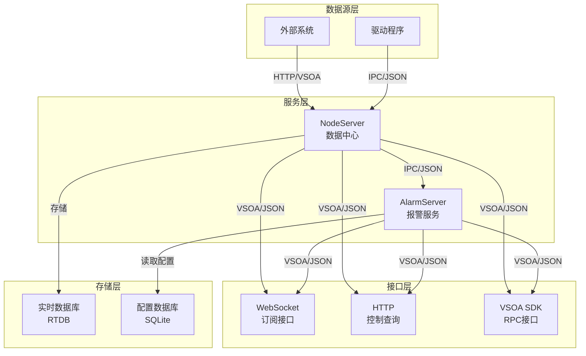

# 综合监控系统通信设计方案

## 1. 系统架构概述

当前系统包含两个核心服务：
- **NodeServer**：数据中心，接收驱动程序上报的点位数据，存储到RTDB，并提供多种接口
- **AlarmServer**：报警服务，接收点位数据，根据配置的报警规则进行判断，发布报警信息

## 2. 当前通信方式分析

### 2.1 NodeServer
- **接收驱动数据**：IPC协议，路径`/tags/update`，数据格式为DataValueDto列表
- **提供接口**：
  - WebSocket：点位数据订阅
  - HTTP：下发控制点位和点位查询
  - VSOA SDK：RPC请求应答（`/tags/read`和`/tags/control`）

### 2.2 AlarmServer
- **接收点位数据**：IPC协议，订阅NodeServer的`/tags/update`路径
- **发布报警信息**：VSOA SDK，路径`/v1/alarm_server/alarm_info/`
- **获取报警规则**：从SQLite数据库读取

### 2.3 存在问题
1. **通信协议不一致**：内部使用IPC，外部使用多种协议
2. **数据格式重复定义**：AlarmServer重新定义DataValueDto
3. **报警逻辑简单**：只支持基本阈值判断
4. **可靠性不足**：缺乏通信故障处理机制
5. **扩展性有限**：难以支持新增数据源和报警类型

## 3. 统一通信协议设计

### 3.1 总体架构



### 3.2 通信协议统一

#### 3.2.1 内部通信
- **协议**：基于IPC的JSON格式
- **路径定义**：
  - `/tags/update`：点位数据更新
  - `/tags/init`：点位初始化
  - `/control`：控制命令下发

#### 3.2.2 外部通信
- **协议**：统一使用VSOA SDK（JSON格式）
- **路径定义**：
  - `/v1/node_server/tags/read`：读取点位
  - `/v1/node_server/tags/control`：控制点位
  - `/v1/node_server/tags/subscribe`：订阅点位
  - `/v1/alarm_server/alarm_info`：报警信息
  - `/v1/alarm_server/rules`：报警规则管理

### 3.3 数据格式定义

#### 3.3.1 点位数据格式（DataValueDto）
```json
{
  "name": "tag_name",
  "value": "tag_value",
  "time": 1234567890123
}
```

#### 3.3.2 控制命令格式（ControlValueDto）
```json
{
  "name": "tag_name",
  "value": "tag_value"
}
```

#### 3.3.3 报警消息格式（AlarmMessageDto）
```json
{
  "point_id": "123",
  "point_name": "temperature",
  "point_value": "85.5",
  "rule_id": 1,
  "rule_name": "高温报警",
  "rule_method": 2,
  "message_type": 1
}
```

#### 3.3.4 报警规则格式（AlarmRuleDto）
```json
{
  "id": 1,
  "name": "高温报警",
  "method": 2,
  "threshold": 80.0,
  "enabled": true,
  "point_id": "123",
  "point_name": "temperature"
}
```

## 4. 报警服务逻辑优化

### 4.1 报警规则扩展

| 规则类型 | 方法代码 | 描述 | 参数 |
|---------|---------|------|------|
| 高高限 | 1 | 超过高阈值 | 阈值 |
| 高限 | 2 | 超过阈值 | 阈值 |
| 低限 | 3 | 低于阈值 | 阈值 |
| 低低限 | 4 | 低于低阈值 | 阈值 |
| 定值 | 5 | 等于特定值 | 目标值 |
| 变化率 | 6 | 变化率超过阈值 | 阈值、时间窗口 |
| 持续时间 | 7 | 持续超过/低于阈值 | 阈值、持续时间 |
| 偏差 | 8 | 与参考值偏差超过阈值 | 参考值、阈值 |

### 4.2 报警处理流程

1. **数据接收**：从NodeServer订阅点位数据
2. **规则匹配**：根据点位ID匹配对应的报警规则
3. **优先级排序**：按照规则优先级排序（定值 > 高高限 > 高限 > 低限 > 低低限 > 其他）
4. **报警判断**：依次判断各规则是否触发
5. **状态管理**：维护报警状态，避免重复报警
6. **报警发布**：发布报警触发或恢复消息
7. **历史记录**：存储报警历史到数据库

### 4.3 报警状态管理

- **活动状态**：报警正在触发中
- **恢复状态**：报警已恢复
- **确认状态**：报警已被确认
- **屏蔽状态**：报警被暂时屏蔽

## 5. 服务间通信逻辑重新设计

### 5.1 NodeServer → AlarmServer

1. **数据推送**：
   - NodeServer在收到点位更新时，通过IPC推送给AlarmServer
   - 采用批量推送方式，减少通信开销
   - 包含点位名称、值、时间戳等信息

2. **心跳机制**：
   - 定期发送心跳包，确保连接正常
   - 超时未收到心跳时，AlarmServer进入降级模式

3. **重连机制**：
   - 连接断开时自动重连
   - 重连失败时记录日志并继续尝试

### 5.2 AlarmServer → 外部

1. **报警发布**：
   - 采用发布-订阅模式
   - 支持WebSocket和VSOA SDK两种订阅方式
   - 报警消息包含完整的报警信息

2. **报警查询**：
   - 提供历史报警查询接口
   - 支持按时间、点位、类型等条件过滤

3. **规则管理**：
   - 提供报警规则的增删改查接口
   - 支持规则的启用/禁用

## 6. 可靠性设计

### 6.1 故障处理

1. **通信故障**：
   - 连接断开时自动重连
   - 重连期间缓存数据
   - 恢复连接后批量同步

2. **数据丢失**：
   - 关键数据本地缓存
   - 定期持久化到磁盘
   - 恢复后数据一致性检查

3. **服务故障**：
   - 服务异常时自动重启
   - 启动时恢复上次状态
   - 关键配置双重备份

### 6.2 性能优化

1. **数据压缩**：
   - 批量数据压缩传输
   - 减少网络带宽占用

2. **消息队列**：
   - 使用消息队列缓冲峰值数据
   - 异步处理非实时任务

3. **缓存机制**：
   - 热点数据内存缓存
   - 减少数据库访问

## 7. 实现建议

### 7.1 代码重构

1. **数据结构共享**：
   - 创建公共的DTO定义库
   - 避免重复定义数据结构

2. **通信模块统一**：
   - 抽象通信接口
   - 支持多种协议的统一实现

3. **配置管理优化**：
   - 集中管理配置项
   - 支持运行时配置更新

### 7.2 部署建议

1. **容器化部署**：
   - 使用Docker容器化服务
   - 简化部署和管理

2. **监控体系**：
   - 监控服务健康状态
   - 监控通信链路质量
   - 监控报警处理性能

3. **日志管理**：
   - 统一日志格式
   - 分级日志存储
   - 支持日志分析

## 8. 总结

通过统一通信协议、优化报警逻辑、增强可靠性设计，可以构建一个更加健壮、灵活和可扩展的综合监控系统。系统将能够更好地处理点位数据的采集、存储、分析和报警，为上层应用提供更加可靠的服务。

关键改进点：
1. 统一内部和外部通信协议
2. 扩展报警规则类型和处理逻辑
3. 增强通信可靠性和故障处理
4. 优化系统性能和资源使用
5. 提升系统可扩展性和可维护性