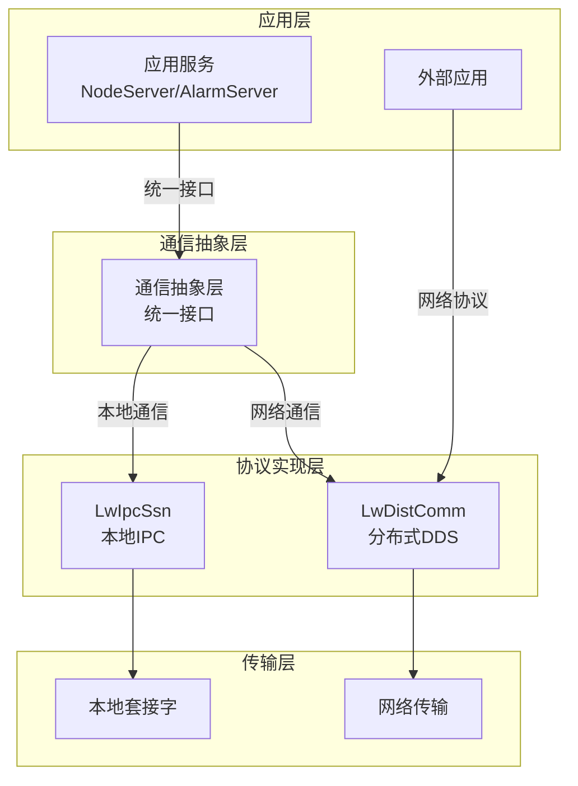

# 通信框架分析与统一方案设计

## 1. 框架分析

### 1.1 LwDistComm (DDS协议)

#### 核心特点
- **分布式通信**：基于DDS协议，支持多节点、跨网络通信
- **发布-订阅模式**：通过`lwdistcomm_client_subscribe`和`lwdistcomm_server_publish`实现
- **RPC请求-响应**：通过`lwdistcomm_client_rpc`和`lwdistcomm_server_add_handler`实现
- **数据报通信**：支持无连接的数据包传输
- **安全机制**：提供认证回调接口
- **事件驱动**：支持文件描述符轮询和事件处理

#### 适用场景
- 跨网络的分布式系统通信
- 需要高可靠性的消息传递
- 复杂网络环境下的服务间通信
- 外部系统与内部服务的通信

### 1.2 LwIpcSsn (IPC协议)

#### 核心特点
- **本地进程间通信**：基于Unix域套接字，性能优异
- **发布-订阅模式**：通过`ipc_server_publish`和客户端订阅实现
- **RPC请求-响应**：通过`ipc_server_add_listener`和客户端RPC实现
- **数据报通信**：支持`ipc_server_cli_datagram`和`ipc_client_send_datagram`
- **心跳机制**：内置`VSOA_SERVER_KEEPALIVE_TIMEOUT`设置
- **事件驱动**：支持`ipc_server_fds`和`ipc_server_input_fds`进行事件处理

#### 适用场景
- 本地进程间的高效通信
- 同一主机内的服务间通信
- 对性能要求较高的场景
- 内部服务之间的通信

## 2. 当前系统通信需求分析

### 2.1 通信场景

| 通信场景 | 通信类型 | 数据量 | 实时性要求 | 可靠性要求 |
|---------|---------|-------|-----------|-----------|
| 驱动程序 → NodeServer | 本地IPC | 中高 | 高 | 高 |
| NodeServer → AlarmServer | 本地IPC | 中 | 高 | 高 |
| 外部系统 → NodeServer | 网络通信 | 低中 | 中 | 中高 |
| 外部系统 → AlarmServer | 网络通信 | 低 | 中 | 中 |
| NodeServer → 外部系统 | 网络通信 | 中低 | 中 | 中 |
| AlarmServer → 外部系统 | 网络通信 | 低 | 中 | 中 |

### 2.2 现有问题

1. **协议不一致**：内部使用IPC，外部使用多种协议
2. **接口不统一**：不同框架的API差异较大
3. **可维护性差**：需要维护多种通信协议的代码
4. **扩展性有限**：难以适应不同的部署环境

## 3. 统一通信方案设计

### 3.1 总体架构



### 3.2 通信抽象层设计

#### 3.2.1 核心接口

```cpp
// 通信抽象接口
class ICommunicator {
public:
    virtual ~ICommunicator() = default;
    
    // 发布消息
    virtual bool Publish(const std::string& topic, const std::string& message) = 0;
    
    // 订阅消息
    virtual bool Subscribe(const std::string& topic, MessageCallback callback) = 0;
    
    // 取消订阅
    virtual bool Unsubscribe(const std::string& topic) = 0;
    
    // RPC请求
    virtual bool RpcRequest(const std::string& url, const std::string& request, RpcCallback callback) = 0;
    
    // 添加RPC处理器
    virtual bool AddRpcHandler(const std::string& url, RpcHandler handler) = 0;
    
    // 移除RPC处理器
    virtual bool RemoveRpcHandler(const std::string& url) = 0;
    
    // 处理事件
    virtual bool ProcessEvents() = 0;
    
    // 获取文件描述符
    virtual int GetFds(fd_set* rfds) = 0;
    
    // 处理输入事件
    virtual bool ProcessInput(const fd_set* rfds) = 0;
};

// 工厂类
class CommunicatorFactory {
public:
    static std::unique_ptr<ICommunicator> CreateLocalCommunicator(const std::string& name);
    static std::unique_ptr<ICommunicator> CreateDistributedCommunicator(const std::string& name, const std::string& address);
};
```

#### 3.2.2 实现类

- **LocalCommunicator**：基于LwIpcSsn实现本地IPC通信
- **DistributedCommunicator**：基于LwDistComm实现分布式网络通信

### 3.3 通信协议映射

#### 3.3.1 内部通信 (LocalCommunicator)

| 功能 | LwIpcSsn接口 | 抽象层接口 |
|------|------------|-----------|
| 发布消息 | `ipc_server_publish` | `Publish` |
| 订阅消息 | 客户端回调 | `Subscribe` |
| RPC请求 | `ipc_server_cli_reply` | `RpcRequest` |
| RPC处理 | `ipc_server_add_listener` | `AddRpcHandler` |
| 事件处理 | `ipc_server_fds`/`ipc_server_input_fds` | `GetFds`/`ProcessInput` |

#### 3.3.2 外部通信 (DistributedCommunicator)

| 功能 | LwDistComm接口 | 抽象层接口 |
|------|---------------|-----------|
| 发布消息 | `lwdistcomm_server_publish` | `Publish` |
| 订阅消息 | `lwdistcomm_client_subscribe` | `Subscribe` |
| RPC请求 | `lwdistcomm_client_rpc` | `RpcRequest` |
| RPC处理 | `lwdistcomm_server_add_handler` | `AddRpcHandler` |
| 事件处理 | `lwdistcomm_server_get_fds`/`lwdistcomm_server_process_input` | `GetFds`/`ProcessInput` |

### 3.4 统一数据格式

#### 3.4.1 消息结构

```cpp
class CommMessage {
public:
    std::string topic;         // 消息主题
    std::string content;       // 消息内容
    std::string timestamp;     // 时间戳
    std::string sender;        // 发送者标识
    
    // 序列化/反序列化
    std::string Serialize() const;
    static CommMessage Deserialize(const std::string& data);
};
```

#### 3.4.2 RPC请求/响应结构

```cpp
class RpcRequest {
public:
    std::string method;        // 方法名
    std::string params;        // 参数（JSON格式）
    std::string id;            // 请求ID
};

class RpcResponse {
public:
    std::string result;        // 结果（JSON格式）
    std::string error;         // 错误信息
    std::string id;            // 请求ID
};
```

## 4. 服务间通信设计

### 4.1 NodeServer

#### 内部通信（与驱动程序和AlarmServer）
- **协议**：LwIpcSsn（本地IPC）
- **路径**：
  - `/tags/update`：接收驱动程序上报的点位数据
  - `/tags/init`：接收驱动程序的点位初始化数据
  - `/control`：下发控制命令到驱动程序

#### 外部通信（与外部系统）
- **协议**：LwDistComm（DDS协议）
- **路径**：
  - `/v1/node_server/tags/read`：读取点位数据
  - `/v1/node_server/tags/control`：控制点位
  - `/v1/node_server/tags/subscribe`：订阅点位数据

### 4.2 AlarmServer

#### 内部通信（与NodeServer）
- **协议**：LwIpcSsn（本地IPC）
- **路径**：
  - `/tags/update`：订阅NodeServer的点位数据

#### 外部通信（与外部系统）
- **协议**：LwDistComm（DDS协议）
- **路径**：
  - `/v1/alarm_server/alarm_info`：发布报警信息
  - `/v1/alarm_server/rules`：管理报警规则

## 5. 实现建议

### 5.1 代码结构

```
src/
├── comms/
│   ├── abstraction/          # 通信抽象层
│   │   ├── communicator.h    # 统一接口定义
│   │   ├── local_communicator.cpp    # 本地IPC实现
│   │   └── distributed_communicator.cpp  # 分布式DDS实现
│   ├── lwdistcomm/           # 现有DDS实现
│   └── lwipc_ssn/            # 现有IPC实现
├── service/
│   ├── nodeserver/
│   │   ├── comm_manager.cpp  # 通信管理器
│   │   └── ...
│   └── alarm-server/
│       ├── comm_manager.cpp  # 通信管理器
│       └── ...
```

### 5.2 核心组件

#### 5.2.1 通信管理器

```cpp
class CommManager {
public:
    // 初始化本地通信
    int InitLocalComm(const std::string& name);
    
    // 初始化分布式通信
    int InitDistributedComm(const std::string& name, const std::string& address);
    
    // 发布消息
    bool Publish(const std::string& topic, const std::string& message, bool local = true);
    
    // 订阅消息
    bool Subscribe(const std::string& topic, MessageCallback callback, bool local = true);
    
    // RPC请求
    bool RpcRequest(const std::string& url, const std::string& request, RpcCallback callback, bool local = false);
    
    // 添加RPC处理器
    bool AddRpcHandler(const std::string& url, RpcHandler handler, bool local = true);
    
    // 处理事件
    bool ProcessEvents();
    
private:
    std::unique_ptr<ICommunicator> local_comm_;
    std::unique_ptr<ICommunicator> distributed_comm_;
};
```

#### 5.2.2 消息路由器

```cpp
class MessageRouter {
public:
    // 注册消息处理器
    void RegisterHandler(const std::string& topic, MessageHandler handler);
    
    // 路由消息
    void RouteMessage(const std::string& topic, const std::string& message);
    
private:
    std::unordered_map<std::string, MessageHandler> handlers_;
};
```

### 5.3 部署方案

#### 5.3.1 本地部署
- **适用场景**：所有服务部署在同一主机
- **通信方式**：全部使用LwIpcSsn本地IPC通信
- **优势**：性能优异，部署简单

#### 5.3.2 分布式部署
- **适用场景**：服务部署在不同主机或容器
- **通信方式**：
  - 本地服务间：LwIpcSsn
  - 跨主机服务：LwDistComm
- **优势**：灵活性高，适应复杂环境

#### 5.3.3 混合部署
- **适用场景**：部分服务本地部署，部分服务远程部署
- **通信方式**：根据部署位置自动选择
- **优势**：平衡性能和灵活性

## 6. 性能与可靠性考虑

### 6.1 性能优化

1. **消息批处理**：
   - 本地通信：批量处理点位数据，减少IPC调用次数
   - 网络通信：压缩消息，减少网络传输开销

2. **连接池管理**：
   - 维护长连接，减少连接建立开销
   - 动态调整连接数，适应负载变化

3. **异步处理**：
   - 非阻塞IO，提高并发处理能力
   - 消息队列缓冲，平滑峰值负载

### 6.2 可靠性保障

1. **重连机制**：
   - 连接断开时自动重连
   - 重连失败时指数退避策略

2. **心跳检测**：
   - 定期发送心跳包，检测连接状态
   - 超时未收到心跳时触发重连

3. **消息重试**：
   - 可靠消息传输，确保消息送达
   - 幂等性设计，避免重复处理

4. **故障转移**：
   - 支持多节点部署，实现高可用
   - 自动检测节点健康状态，进行故障转移

## 7. 总结

### 7.1 方案优势

1. **统一接口**：屏蔽底层协议差异，提供一致的编程体验
2. **灵活性高**：根据部署环境自动选择合适的通信协议
3. **性能优异**：本地通信使用高性能IPC，网络通信使用可靠的DDS
4. **可扩展性强**：易于添加新的通信协议和适配不同的部署环境
5. **可靠性高**：完善的故障处理和恢复机制

### 7.2 实施建议

1. **分阶段实施**：
   - 第一阶段：实现通信抽象层，保持现有功能不变
   - 第二阶段：迁移内部通信到统一接口
   - 第三阶段：迁移外部通信到统一接口

2. **兼容性保障**：
   - 保持对现有协议的兼容
   - 提供平滑的升级路径

3. **测试验证**：
   - 进行充分的性能测试和可靠性测试
   - 模拟各种故障场景，验证故障恢复能力

4. **监控与运维**：
   - 增加通信状态监控
   - 提供详细的日志和诊断信息

通过本方案，可以构建一个统一、高效、可靠的通信系统，满足不同部署环境的需求，为综合监控系统的稳定运行提供坚实的基础。