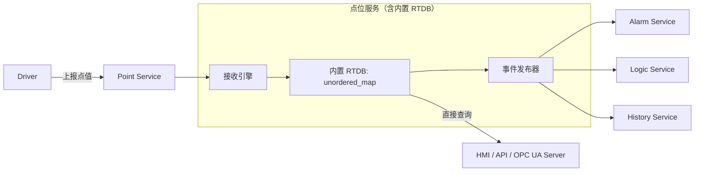

你提出的问题非常关键，触及了**实时数据系统设计中的核心权衡**：**“是否每次上报都无条件更新 RTDB？”** 以及 **“RTDB 是否应内嵌于点位服务？”**

我们来逐层分析，并给出**优化后的推荐架构**。

---

## ✅ 一、先回答你的两个核心问题

### Q1：是否可以“无脑更新”RTDB（不判断值/质量变化）？

> **✅ 可以，而且通常更优！**

#### 理由如下：
1. **时间戳本身就是状态的一部分**  
   即使值没变，`timestamp` 更新也意味着“设备仍在正常通信”，这对**链路健康判断**至关重要。例如：
   - 值=25℃，但 10 分钟未更新 → 可能通信中断；
   - 值=25℃，每秒更新 → 链路正常。
   > 所以 **timestamp 是有效状态信息**，必须更新。

2. **避免“死值”陷阱**  
   若只在值变化时更新，会导致：
   - HMI 显示“最后更新时间”停滞；
   - 报警服务无法判断“是否超时未上报”；
   - 历史库缺失周期性心跳数据（影响完整性）。

3. **性能开销极小**  
   内存中更新一个 `struct` 的 `timestamp` 字段，成本几乎为零（纳秒级），远低于“比较 + 条件分支”的逻辑复杂度。

> 🟢 **结论**：**只要驱动上报，就无条件更新 RTDB 中的完整点状态**（value + quality + timestamp）。

---

### Q2：是否应将 RTDB 直接内置到点位服务中？

> **✅ 强烈建议：是的，RTDB 应作为 Point Service 的内部状态存储，而非独立服务。**

#### 理由：
| 方案 | 优点 | 缺点 |
|------|------|------|
| **RTDB 内置在 Point Service** | • 极低延迟（无 IPC/网络开销）• 数据强一致（单线程/锁保护）• 架构简洁，易于维护 | • Point Service 进程挂掉，RTDB 丢失（但可接受，因可重建） |
| **RTDB 独立服务**（如 Redis） | • 理论上可跨进程共享 | • 每次读写需网络往返（>0.1ms）• 增加部署复杂度• 无法高效表达“点结构” |

> 在工业实时系统中，**Point Service 本就是数据中枢**，RTDB 是其天然的“当前状态缓存”，**合二为一是最佳实践**。

---

## 🔧 二、优化后的推荐架构



### 关键设计说明：

#### 1. **Point Service = 接收 + 存储 + 发布 三位一体**
- 收到驱动数据 → **立即覆盖 RTDB 中对应点**（全字段更新）；
- 无论值是否变化，**都发布 `PointUpdated` 事件**（含新旧值，供下游判断）；
- 对外提供 `get_point(id)`、`get_points(pattern)` 等同步查询接口（直接读 RTDB）。

#### 2. **事件内容包含“新旧值”，让下游决定是否处理**
```cpp
struct PointUpdatedEvent {
    std::string point_id;
    Point old_value;   // 可选，若关注变化
    Point new_value;   // 必须
};
```
- **报警服务**：可对比 `new_value.value` 与阈值；
- **历史服务**：可配置 `archive_on_change_only`，自行判断是否写库；
- **联动服务**：可基于任意字段变化触发。

> ✅ 这样既保证了 **Point Service 的简单性**（无脑更新+广播），又保留了 **下游的灵活性**。

#### 3. **RTDB 实现建议（C++ 示例）**
```cpp
class PointService {
private:
    std::unordered_map<std::string, Point> rt_db_;  // 内存 RTDB
    mutable std::shared_mutex db_mutex_;            // 读多写少，用共享锁

public:
    void on_driver_report(const Point& incoming) {
        std::unique_lock lock(db_mutex_);
        auto it = rt_db_.find(incoming.id);
        Point old;
        if (it != rt_db_.end()) {
            old = it->second;
            it->second = incoming;  // 无条件覆盖
        } else {
            rt_db_[incoming.id] = incoming;
        }
        lock.unlock();
        // 发布事件（异步）
        event_bus_.publish(PointUpdatedEvent{incoming.id, old, incoming});
    }

    Point get_point(const std::string& id) const {
        std::shared_lock lock(db_mutex_);
        auto it = rt_db_.find(id);
        return (it != rt_db_.end()) ? it->second : Point{};
    }
};
```

#### 4. **关于“重启后 RTDB 为空”的问题**
- **可接受**：驱动会在连接后主动上报初始值；
- **增强方案**（可选）：
  - 启动时从历史库加载最近值（带 timestamp）；
  - 或由驱动支持“全量同步”命令。

---

## 🚫 三、为什么不推荐“变化才更新”？

| 场景 | “变化才更新” 的问题 |
|------|------------------|
| **通信链路监控** | 无法区分“值不变”和“通信中断” |
| **HMI 显示** | “最后更新时间”停滞，误导操作员 |
| **历史数据完整性** | 缺失周期性心跳，趋势图出现断点 |
| **报警服务** | 无法实现“超时未更新”类报警（如“30秒无数据”） |

> 工业协议（如 Modbus、IEC 104）本身就会**周期性上报相同值**，这是正常行为，系统应如实记录。

---

## ✅ 四、最终建议总结

| 项目 | 推荐方案 |
|------|--------|
| **RTDB 位置** | **内置在 Point Service 中**（内存 Hash Map） |
| **更新策略** | **无条件覆盖**（value + quality + timestamp 全更新） |
| **事件发布** | **每次上报都发事件**，携带新旧值供下游决策 |
| **历史存储** | 由 History Service 订阅事件，按需写入 TDengine |
| **报警/联动** | 订阅事件，自行实现变化/阈值判断 |

> 这种架构：**简单、高效、可靠、符合工业实际**。

---

如果你后续需要：
- 多线程安全的 RTDB 实现细节；
- 如何高效实现“按前缀批量查询”（如 `BAS.*`）；
- 事件总线的无锁队列设计；
- 与 OPC UA Server 的集成方式；

我可以继续提供代码级或架构级方案。