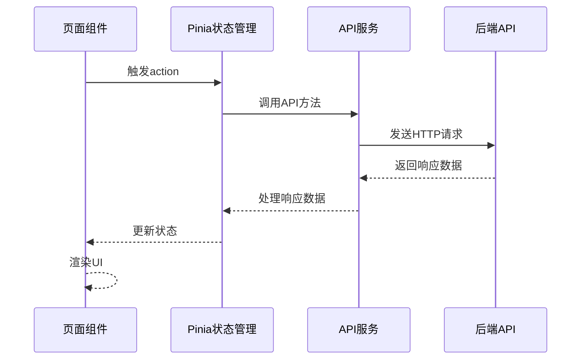

查看当前web平台的目录结构，了解现有的代码组织和功能实现。
        
            
toolName: run_command
            
status: success
          
command: ls -la /home/yanchaodong/work/acoinfo/edge-framework/src/web undefined
          
查看src目录的结构，了解现有的代码组织和功能实现。
        
            
toolName: run_command
            
status: success
          
command: ls -la /home/yanchaodong/work/acoinfo/edge-framework/src/web/src undefined
          
查看components目录的结构，了解现有的组件实现。
        
            
toolName: run_command
            
status: success
          
command: ls -la /home/yanchaodong/work/acoinfo/edge-framework/src/web/src/components undefined
          
查看package.json文件，了解项目依赖和构建配置。
        
            
toolName: view_files
            
status: success
          
            
filePath: /home/yanchaodong/work/acoinfo/edge-framework/src/web/package.json
          
# 综合监控系统前端平台评审与重新设计方案

## 一、现有平台评审

### 1. 项目结构分析

**优势：**
- 目录结构清晰，按功能模块划分组件
- 使用Vue 3 + Vite构建，技术栈较新
- 模块化组织代码，便于维护

**不足：**
- 依赖过于简单，缺少必要的前端库
- 单页面应用，缺少路由管理
- 缺少状态管理，复杂状态难以管理
- 缺少UI组件库，界面美观度不足
- 缺少HTTP客户端，API调用实现可能不够规范
- 缺少数据可视化组件，监控系统核心功能缺失

### 2. 功能模块分析

**现有功能：**
- 驱动管理
- 设备管理
- 点位管理
- 报警联动
- 系统配置

**不足：**
- 缺少实时数据监控面板
- 缺少历史数据趋势分析
- 缺少用户权限管理
- 缺少系统健康状态监控
- 缺少日志管理
- 缺少配置导入导出功能
- 缺少多语言支持

## 二、重新设计方案

### 1. 技术选型

| 类别 | 技术/库 | 版本 | 选型理由 |
|------|---------|------|----------|
| 框架 | Vue | 3.5+ | 响应式框架，生态成熟，适合构建复杂前端应用 |
| 语言 | TypeScript | 5.0+ | 类型安全，提高代码质量和开发效率 |
| 构建工具 | Vite | 6.0+ | 快速的开发服务器和构建工具 |
| UI组件库 | Element Plus | 2.5+ | 丰富的组件库，适合企业级应用，支持响应式设计 |
| 状态管理 | Pinia | 2.1+ | 轻量级状态管理，Vue 3官方推荐 |
| HTTP客户端 | Axios | 1.6+ | 功能强大的HTTP客户端，支持拦截器和请求配置 |
| 路由 | Vue Router | 4.2+ | 官方路由库，支持嵌套路由和路由守卫 |
| 数据可视化 | ECharts | 5.4+ | 强大的数据可视化库，适合监控系统的图表展示 |
| 表单验证 | VeeValidate | 4.12+ | 灵活的表单验证库 |
| 国际化 | i18n | 9.9+ | 官方国际化库，支持多语言切换 |
| 代码规范 | ESLint + Prettier | 最新版 | 统一代码风格，提高代码质量 |

### 2. 架构设计

#### 2.1 目录结构

```
src/
├── assets/          # 静态资源
├── components/      # 通用组件
│   ├── common/      # 基础组件
│   ├── dashboard/   # 仪表盘组件
│   ├── device/      # 设备相关组件
│   ├── driver/      # 驱动相关组件
│   ├── point/       # 点位相关组件
│   ├── alarm/       # 报警相关组件
│   ├── linkage/     # 联动相关组件
│   └── system/      # 系统相关组件
├── composables/     # 组合式API
├── config/          # 配置文件
├── directives/      # 自定义指令
├── layouts/         # 布局组件
├── locales/         # 国际化资源
├── plugins/         # 插件
├── router/          # 路由配置
├── services/        # API服务
├── stores/          # Pinia状态管理
├── styles/          # 全局样式
├── types/           # TypeScript类型定义
├── utils/           # 工具函数
├── views/           # 页面组件
│   ├── dashboard/   # 仪表盘页面
│   ├── device/      # 设备管理页面
│   ├── driver/      # 驱动管理页面
│   ├── point/       # 点位管理页面
│   ├── alarm/       # 报警管理页面
│   ├── linkage/     # 联动规则页面
│   ├── system/      # 系统配置页面
│   └── user/        # 用户管理页面
├── App.vue          # 根组件
└── main.ts          # 入口文件
```

#### 2.2 核心架构图



### 3. 功能模块设计

#### 3.1 仪表盘模块

**核心功能：**
- 系统概览（设备数量、点位数量、报警数量）
- 实时数据监控面板
- 最近报警列表
- 系统健康状态
- 关键指标趋势图

**设计亮点：**
- 响应式布局，适配不同屏幕尺寸
- 可自定义仪表盘组件
- 数据实时更新（WebSocket或轮询）
- 支持深色/浅色模式切换

#### 3.2 设备管理模块

**核心功能：**
- 设备列表（支持分页、搜索、筛选）
- 设备详情查看
- 设备添加/编辑/删除
- 设备状态监控
- 设备批量操作

**设计亮点：**
- 树形结构展示设备层级关系
- 设备状态可视化（在线/离线/警告/故障）
- 设备操作历史记录
- 设备配置模板

#### 3.3 点位管理模块

**核心功能：**
- 点位列表（支持分页、搜索、筛选）
- 点位详情查看
- 点位添加/编辑/删除
- 点位值实时监控
- 点位历史数据趋势

**设计亮点：**
- 点位分组管理
- 点位值可视化展示
- 点位阈值设置
- 点位数据导出

#### 3.4 报警管理模块

**核心功能：**
- 报警规则配置
- 报警列表（支持分页、搜索、筛选）
- 报警详情查看
- 报警确认/处理
- 报警历史记录

**设计亮点：**
- 报警级别可视化（信息/警告/错误/严重）
- 报警趋势分析图表
- 报警通知设置
- 报警规则模板

#### 3.5 联动规则模块

**核心功能：**
- 联动规则配置
- 联动规则列表
- 联动规则启用/禁用
- 联动历史记录

**设计亮点：**
- 可视化规则编辑器
- 联动规则测试功能
- 联动执行日志
- 联动规则优先级设置

#### 3.6 系统配置模块

**核心功能：**
- 网络配置
- NTP配置
- 系统参数配置
- 用户管理
- 权限管理

**设计亮点：**
- 配置导入导出
- 配置版本管理
- 系统备份恢复
- 系统日志查看

#### 3.7 数据可视化模块

**核心功能：**
- 实时数据监控面板
- 历史数据趋势图表
- 数据对比分析
- 数据导出（CSV、Excel、PDF）

**设计亮点：**
- 多种图表类型支持（折线图、柱状图、饼图、仪表盘等）
- 图表交互功能（缩放、平移、数据点提示）
- 自定义图表配置
- 大数据量处理优化

### 4. 用户界面设计

#### 4.1 设计风格

**整体风格：**
- 现代简约风格
- 专业监控系统视觉
- 深色主题为主，浅色主题为辅
- 高对比度，确保数据清晰可见

**配色方案：**
- 主色调：深蓝色 (#1E40AF)
- 辅助色：绿色 (#10B981)、黄色 (#F59E0B)、红色 (#EF4444)
- 背景色：深灰 (#1E293B)、浅灰 (#F1F5F9)
- 文本色：白色 (#FFFFFF)、深灰 (#334155)

#### 4.2 响应式设计

**设计原则：**
- 移动优先设计
- 断点设置：
  - 移动设备：< 768px
  - 平板设备：768px - 1024px
  - 桌面设备：> 1024px
- 关键功能在所有设备上可用
- 复杂图表在小屏幕上简化展示

#### 4.3 交互设计

**设计原则：**
- 简洁直观的操作流程
- 即时反馈用户操作
- 渐进式表单填写
- 智能错误提示
- 快捷键支持
- 拖拽功能支持

### 5. 性能优化策略

1. **代码分割：**
   - 路由级别代码分割
   - 组件懒加载
   - 第三方库按需引入

2. **网络优化：**
   - API请求缓存
   - 批量API请求
   - WebSocket实时数据传输
   - 图片资源优化

3. **渲染优化：**
   - 虚拟列表（大数据量列表）
   - 防抖和节流
   - 计算属性和缓存
   - 避免不必要的重渲染

4. **构建优化：**
   - Tree Shaking
   - 代码压缩
   - 按需编译
   - 静态资源CDN

### 6. 部署方案

1. **构建流程：**
   - 使用Vite构建生产版本
   - 生成静态资源
   - 配置CDN路径

2. **部署方式：**
   - Nginx静态文件服务器
   - Docker容器化部署
   - 持续集成/持续部署(CI/CD)

3. **环境配置：**
   - 开发环境：本地开发服务器
   - 测试环境：独立测试服务器
   - 生产环境：负载均衡部署

### 7. 开发与维护计划

#### 7.1 开发阶段划分

1. **准备阶段：**
   - 项目初始化
   - 技术栈搭建
   - 基础组件开发

2. **核心功能开发：**
   - 仪表盘模块
   - 设备管理模块
   - 点位管理模块
   - 报警管理模块
   - 联动规则模块
   - 系统配置模块

3. **优化与测试：**
   - 性能优化
   - 兼容性测试
   - 功能测试
   - 用户体验优化

4. **部署与上线：**
   - 生产环境部署
   - 监控与维护

#### 7.2 代码规范与质量保证

1. **代码规范：**
   - ESLint + Prettier配置
   - TypeScript类型定义
   - 代码注释规范

2. **质量保证：**
   - 单元测试
   - 集成测试
   - 端到端测试
   - 代码审查流程

3. **文档管理：**
   - 项目文档
   - API文档
   - 组件文档
   - 开发规范文档

## 三、预期效果

### 1. 技术效果

- 现代化前端技术栈，提高开发效率和代码质量
- 模块化架构，便于扩展和维护
- 性能优化，提升用户体验
- 响应式设计，适配不同设备

### 2. 功能效果

- 完整的监控系统功能，满足工业级需求
- 实时数据监控，及时发现问题
- 丰富的数据可视化，直观展示系统状态
- 智能报警和联动，提高系统自动化水平

### 3. 用户体验效果

- 专业美观的界面设计，提升用户满意度
- 直观易用的操作流程，降低使用门槛
- 实时反馈和提示，提高操作效率
- 个性化配置，满足不同用户需求

## 四、总结

本设计方案基于现有平台的基础，通过引入现代化的前端技术栈和完善的功能模块，打造一个专业、高效、美观的综合监控系统前端平台。方案充分考虑了监控系统的特点和需求，重点加强了数据可视化、实时监控、报警联动等核心功能，同时注重用户体验和系统性能，为用户提供一个功能完整、操作便捷的监控系统管理界面。

通过本方案的实施，综合监控系统前端平台将达到工业级应用的标准，能够满足复杂监控场景的需求，为系统运维和管理提供有力的支持。