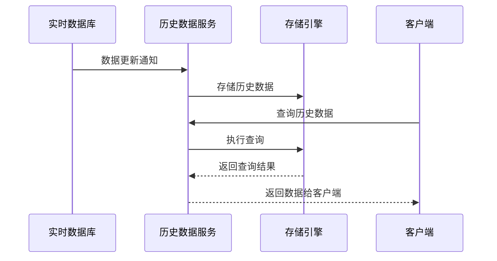

# 历史数据服务设计方案

## 1. 服务概述

历史数据服务是一个专门用于存储和查询边缘设备历史数据的服务，基于当前的NodeServer架构设计。该服务负责从RTDB中采集实时数据并持久化存储，同时提供丰富的查询接口供其他服务和应用使用。

## 2. 架构设计

### 2.1 核心组件

| 组件 | 职责 | 文件位置 |
|------|------|----------|
| HistoryService | 历史数据服务核心类 | src/service/history-service/history_service.cpp |
| HistoryStorage | 历史数据存储接口 | src/service/history-service/history_storage.h |
| FileStorage | 文件系统存储实现 | src/service/history-service/storage/file_storage.cpp |
| TimeSeriesStorage | 时序数据库存储实现 | src/service/history-service/storage/tsdb_storage.cpp |
| HistoryQuery | 历史数据查询接口 | src/service/history-service/history_query.cpp |
| HistoryManager | 历史数据管理类 | src/service/history-service/history_manager.cpp |
| VSOA Handler | VSOA RPC接口处理 | src/service/history-service/vsoa_handler.cpp |
| DDS Handler | DDS接口处理 | src/service/history-service/dds_handler.cpp |

### 2.2 数据流程



## 3. 数据模型

### 3.1 历史数据记录

```cpp
typedef struct {
    std::string tag_name;      // 标签名称
    std::string value;         // 标签值
    uint64_t timestamp_ms;     // 时间戳（毫秒）
    std::string quality;       // 数据质量
    std::string driver_name;   // 驱动名称
    std::string device_name;   // 设备名称
} HistoryRecord;
```

### 3.2 查询参数

```cpp
typedef struct {
    std::vector<std::string> tags;      // 标签列表
    uint64_t start_time_ms;             // 开始时间
    uint64_t end_time_ms;               // 结束时间
    uint32_t interval_ms;               // 采样间隔
    std::string aggregation;            // 聚合方式（avg, max, min, sum, last）
} HistoryQueryParams;
```

## 4. 接口设计

### 4.1 VSOA RPC接口

| 接口路径 | 方法 | 功能描述 | 请求参数 | 响应参数 |
|---------|------|----------|----------|----------|
| /history/query | POST | 查询历史数据 | `{"tags": ["tag1", "tag2"], "startTime": 1234567890000, "endTime": 1234567900000, "interval": 1000, "aggregation": "avg"}` | `[{"tag": "tag1", "data": [{"time": 1234567890000, "value": "100"}]}]` |
| /history/stats | GET | 获取存储统计信息 | N/A | `{"totalRecords": 1000000, "storageSize": 1024000000, "retentionDays": 7}` |
| /history/config | PUT | 更新存储配置 | `{"retentionDays": 30, "maxStorageSize": 5368709120}` | `{"status": "ok"}` |

### 4.2 DDS接口

| 接口路径 | 功能描述 | 请求格式 | 响应格式 |
|---------|----------|----------|----------|
| /history/query | 查询历史数据 | `{"tags": ["tag1"], "start": 1234567890000, "end": 1234567900000}` | `{"status": "ok", "data": [{"tag": "tag1", "values": [[1234567890000, "100"]]}` |
| /history/info | 获取服务信息 | N/A | `{"status": "ok", "version": "1.0.0", "records": 1000000}` |

### 4.3 C++ API

```cpp
// 历史数据服务类
class HistoryService {
public:
    static HistoryService* GetInstance();
    int Start();
    int Stop();
    
    // 存储历史数据
    bool StoreHistory(const HistoryRecord& record);
    
    // 查询历史数据
    std::vector<HistoryRecord> QueryHistory(const HistoryQueryParams& params);
    
    // 获取存储统计信息
    HistoryStats GetStats();
    
    // 更新配置
    bool UpdateConfig(const HistoryConfig& config);
};
```

## 5. 存储实现

### 5.1 文件系统存储

- **存储格式**：按天分文件，每个文件包含当天的历史数据
- **文件结构**：`data/{year}/{month}/{day}/{tag_name}.json`
- **数据格式**：JSON数组，每条记录包含时间戳和值
- **优点**：实现简单，便于备份和迁移
- **缺点**：查询性能较差，特别是大范围查询

### 5.2 时序数据库存储（可选）

- **推荐方案**：使用SQLite或LevelDB实现轻量级时序存储
- **数据模型**：按标签分区，时间戳索引
- **优点**：查询性能优异，支持复杂查询
- **缺点**：实现复杂度较高

## 6. 集成方案

### 6.1 与NodeServer集成

1. **数据采集**：通过RTDB的更新回调机制，当数据变化时自动存储
2. **配置同步**：从NodeServer获取标签配置信息
3. **服务发现**：通过现有的服务发现机制注册

### 6.2 与其他服务集成

1. **HMI集成**：提供历史数据查询接口供HMI展示趋势图
2. **报警服务集成**：提供历史报警数据存储和查询
3. **边缘计算集成**：为边缘计算服务提供历史数据作为分析输入

## 7. 性能优化

1. **批量存储**：采用批量写入机制，减少I/O操作
2. **内存缓存**：使用LRU缓存缓存热点数据
3. **异步处理**：查询操作采用异步处理，避免阻塞主线程
4. **数据压缩**：对历史数据进行压缩存储，减少存储空间
5. **索引优化**：为常用查询创建索引

## 8. 数据保留策略

1. **时间策略**：默认保留7天数据，可配置
2. **空间策略**：当存储空间达到阈值时，自动清理最旧数据
3. **清理机制**：后台定时任务，定期清理过期数据

## 9. 部署方案

### 9.1 服务启动

- **系统服务**：注册为系统服务，随系统启动
- **依赖**：依赖NodeServer和RTDB
- **配置文件**：`/etc/edge-framework/history-service.conf`

### 9.2 资源需求

| 资源 | 推荐配置 |
|------|----------|
| CPU | 1核 |
| 内存 | 256MB |
| 存储 | 根据数据量和保留策略确定 |

## 10. 监控与告警

1. **存储监控**：监控存储空间使用情况
2. **性能监控**：监控查询响应时间
3. **错误监控**：监控存储和查询错误
4. **告警机制**：当存储空间不足或出现严重错误时触发告警

## 11. 测试计划

1. **功能测试**：测试存储和查询功能
2. **性能测试**：测试高并发查询性能
3. **可靠性测试**：测试服务重启后数据一致性
4. **集成测试**：测试与其他服务的集成

## 12. 实现路径

1. **第一阶段**：实现基本的文件系统存储和查询功能
2. **第二阶段**：集成到NodeServer，实现数据自动采集
3. **第三阶段**：添加VSOA和DDS接口
4. **第四阶段**：优化性能，添加高级查询功能
5. **第五阶段**：测试和部署

## 13. 技术栈

- **开发语言**：C++11+
- **存储**：文件系统 / SQLite
- **通信**：VSOA RPC, DDS
- **依赖**：与NodeServer共享依赖

## 14. 总结

历史数据服务是边缘计算框架中的重要组成部分，为设备数据提供持久化存储和查询能力。通过合理的架构设计和性能优化，可以为上层应用提供高效、可靠的历史数据服务，支持趋势分析、故障诊断、性能评估等多种应用场景。
