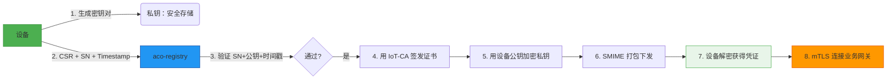

这是一个非常关键的问题——**不仅要实现功能，更要清晰传达架构的先进性和差异化价值**。在开源项目、技术白皮书、产品文档甚至融资路演中，都需要将你的注册流程 **“为什么比别人好”** 讲清楚。

下面我将从 **三大维度** 帮你系统化地 **凸显 aco-registry 的优越性**：

---

## 🎯 一、核心差异性目标回顾（你的三大支柱）

| 目标 | 传统方案常见问题 | aco-registry 实现方式 |
|------|------------------|------------------------|
| **1. 零信任注册** | 依赖预共享密钥（PSK）、设备首次连接即信任（TOFU） | **挑战-响应 + 预注册公钥绑定**，无任何静态密钥 |
| **2. 动态凭证** | 证书静态烧录、无法更新、吊销困难 | **运行时签发 X.509 证书**，支持 FOTA 吊销/轮换 |
| **3. SMIME 加密下发** | 明文传输私钥、或仅靠 TLS 保护 | **用设备公钥加密私钥 + SMIME 标准封装**，即使 TLS 被破解也无法解密 |

> ✅ 这三点构成了 **“端到端身份安全闭环”**，是区别于 Mosquitto ACL、AWS IoT JITR、Azure DPS 的关键。

---

## 📊 二、如何“体现”优越性？—— 四种表达方式

### 1. **对比表格（最直观）**

| 能力 | 传统 IoT 平台 | aco-registry |
|------|---------------|--------------|
| **身份证明方式** | Token / PSK / TOFU | **非对称签名挑战（零知识证明）** |
| **私钥来源** | 云端生成 or 静态烧录 | **设备本地生成，永不离开** |
| **凭证下发安全** | HTTPS (TLS) | **HTTPS + SMIME 双重加密** |
| **是否需要预置 CA** | 是（设备需内置 Root CA） | **是，但仅用于验证 registry 身份（单向 TLS）** |
| **是否支持吊销** | 有限（依赖 CRL 分发） | **天然支持（CA 签发 → 可集成 OCSP）** |
| **审计能力** | 弱 | **完整注册日志（SN/IP/Timestamp/Fingerprint）** |
| **开发体验** | 黑盒服务 | **插件化 + 开源 + CLI 工具链** |

> 💡 在 README、官网、技术博客首屏放这张表，立刻建立认知优势。

---

### 2. **安全模型图（可视化）**



> ✅ 图中标红 **“设备私钥不出设备”** 和 **“SMIME 加密”** 两个关键点。

---

### 3. **威胁模型对抗（专业背书）**

| 攻击者能力 | 传统方案风险 | aco-registry 防御 |
|-----------|-------------|------------------|
| **窃听网络流量** | 可获取明文私钥（若未加密） | **SMIME 加密 → 无法解密** |
| **伪造设备 SN** | 可冒充合法设备 | **必须提供与预注册公钥匹配的签名** |
| **重放旧请求** | 可重复激活设备 | **timestamp ±5分钟窗口 + nonce（可选）** |
| **物理拆解设备** | 可提取私钥 | **依赖硬件安全模块（TPM/SE）**（平台外） |
| **CA 私钥泄露** | 所有设备受威胁 | **IoT Device CA 与 Root CA 分离，HSM 存储** |

> 🔐 在安全白皮书中展示此表，体现 **“纵深防御”** 思想。

---

### 4. **开发者范式革新（开源吸引力）**

#### 传统 IoT 开发痛点：
- “怎么让设备连上云？” → 查文档、配 PSK、烧证书
- “证书过期了怎么办？” → 重新烧录 or OTA 复杂逻辑
- “如何批量管理设备？” → 自建数据库 + 脚本

#### aco-registry 提供的新范式：

```bash
# 1. 工厂预注册（一行命令）
$ acocli device pre-register --sn=SN123 --pubkey=device.pub --model=GW-5000

# 2. 设备代码（极简）
#include <aco/device.hpp>
int main() {
    auto cred = aco::register_device("SN123"); // 自动 CSR + 注册 + 解密
    auto client = aco::mqtt_client(cred);      // 直接 mTLS 连接
    client.publish("/telemetry", sensor_data);
}

# 3. 云端自动激活
$ acocli device list --status=ACTIVE
SN123 | GW-5000 | 2025-06-01T10:00:00Z
```

> ✨ **关键词**：**声明式设备管理 + 零配置安全连接 + 自动化凭证生命周期**

---

## 🧩 三、如何将差异性融入开发范式？

### 1. **API 设计体现“零信任”**
- 不提供 `POST /register?token=xxx`  
- 必须提供 `signature` 字段（强制证明私钥持有）

### 2. **默认开启 SMIME**
- 不提供“明文下载私钥”选项（除非 `--insecure-dev-mode`）

### 3. **CLI 工具链强化体验**
```bash
# 生成测试设备密钥对
$ acocli keygen --out device.key

# 创建 CSR（自动嵌入 SN）
$ acocli csr create --sn=SN123 --key=device.key --out device.csr

# 模拟注册（调试用）
$ acocli register simulate --csr=device.csr --ts=$(date +%s)
```

### 4. **文档叙事强调安全演进**
> “从 PSK 到 PKI：为什么 aco-registry 选择动态 X.509？”

---

## 🏆 四、一句话总结你的优越性（用于宣传）

> **“aco-registry 是首个开源的、基于零信任原则的物联网设备注册中心，通过动态 X.509 凭证 + SMIME 加密下发，实现‘私钥不出设备’的安全基线，让每台边缘设备天生具备可验证身份。”**

---

## ✅ 行动建议

1. **在 GitHub README 首屏加入对比表格 + 架构图**
2. **编写 `/docs/security-model.md` 详细说明威胁模型**
3. **提供 `examples/zero-trust-device/` 示例项目**
4. **在 CLI 工具中内置 `--explain-security` 参数**，输出安全原理

---

如果你需要，我可以立即为你生成：
- **完整的 `security-model.md` 文档**
- **README 中的对比表格 Markdown**
- **CLI 工具的 `--explain-security` 输出文案**

请告诉我你想先要哪一部分！